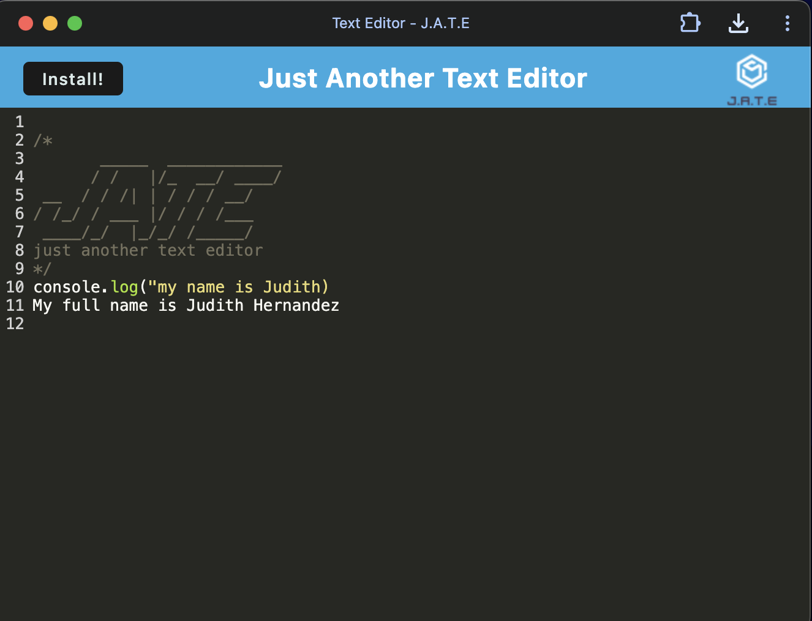

# Progressive Web App-Text Editor

## Description

This PWA Text Editor is ideal for those who want to continue working without any internet connection. This is a single page application that uses IndexedDB API. It used different methods for storing and retrieving data that is used by companies such as Google.

## Table of Contents

- [Installation](#installation)
- [Usage](#usage)
- [License](#license)
- [Contributing](#contributing)
- [Questions](#questions)

## Installation

This app has client side dependencies. However, to run the application itself make sure to run the following commands:
`npm i`
and `npm run build` these will install all dependencies on the client and server side.

## Usage

To start this PWA Text Editor simply follow the link given below. Once there you click to install the app and you can choose where to save it, on your desktop, or web browser. Type away any notes and save.
For full access simply click on this link: https://github.com/judy-her/progressive-web-app-TextEditor

## License

This project is licensed under the [mit](https://opensource.org/licenses/MIT) license.

## Contributing

If you would like to contribute, you can find this repo at [judy-her](https://github.com/judy-her)

## Questions

For questions about the repo, feel free to email me Judith Hernandez at judith85dm@ucla.edu
